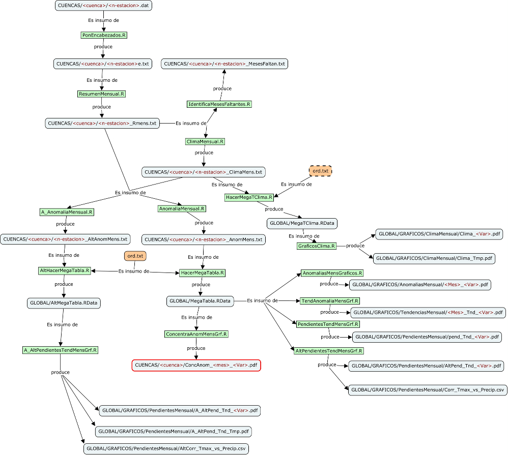

# INTRO
En este documento doy algunas pistas de cómo generar la información del  
proyecto.

En seguida se muestra el diagrama de flujo de la información, como un  
mapa conceptual.

**Figura 1.** Flujo de la información (como un mapa conceptual)

