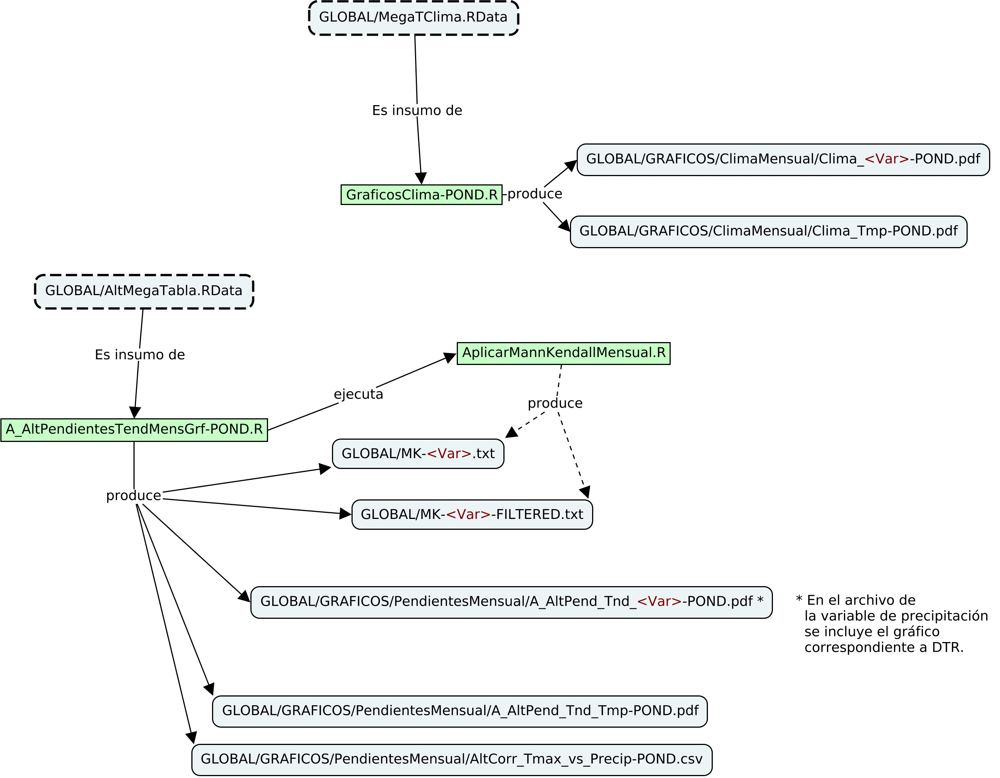
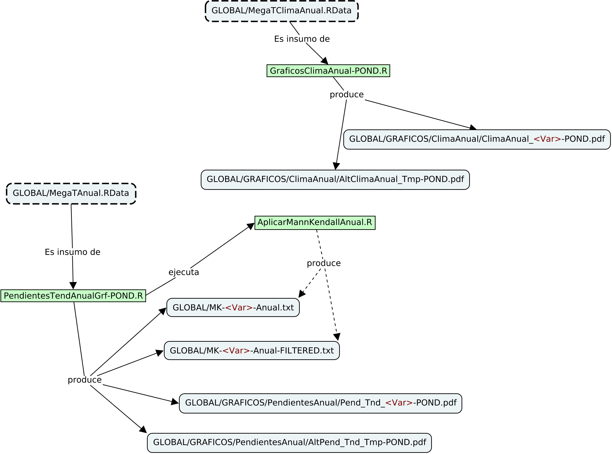

# INTRO
En este documento doy algunas pistas de cómo generar la información del  
proyecto.

# PRODUCCIÓN DE LA INFORMACIÓN
En seguida se muestra el diagrama de flujo de la información para los  
distintos agregados mensuales y luego para los agregados anuales, como  
mapas conceptuales.

**Figura 1.** Flujo de la información - caso mensual (como un mapa conceptual)

El siguiente gráfico muestra el flujo de la información para el caso  
anual. Aunque los caminos son parecidos a los de la Fig. 1, en este  
caso, con la experiencia adquirida anteriormente, se simplificaron  
algunos conceptos.

**Figura 2.** Flujo de la información - caso anual (como un mapa conceptual)

Se hizo un cambio en el cálculo de las medias de los valores de las  
variables por cuenca. Ahora se hace una ponderación de acuerdo con  
los polígonos de Voronoi. Además se hace una calificación de las  
tendencias, por los métodos de Mann-Kendall. Para no perder los  
gráficos anteriores, se desarrollaron nuevas funciones y nuevas salidas  
que se muestran en las Figs. 3 y 4, a continuación.

**Figura 3.** Generación de información ponderada - caso mensual (como un mapa conceptual)

  
.  
.  

**Figura 4.** Generación de información ponderada - caso anual (como un mapa conceptual)

