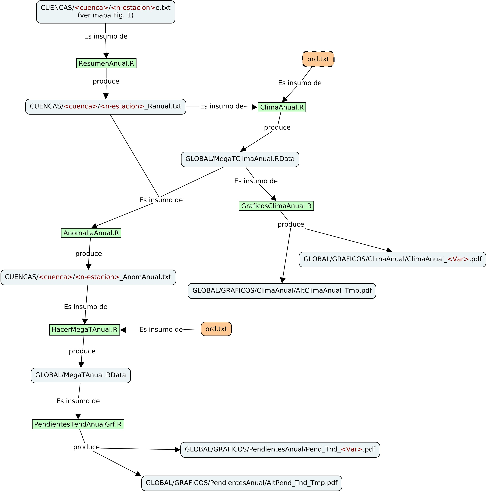

# INTRO
En este documento doy algunas pistas de cómo generar la información del  
proyecto.

# PRODUCCIÓN DE LA INFORMACIÓN
En seguida se muestra el diagrama de flujo de la información para los  
distintos agregados mensuales y luego para los agregados anuales, como  
mapas conceptuales.

**Figura 1.** Flujo de la información - caso mensual (como un mapa conceptual)

El siguiente gráfico muestra el flujo de la información para el caso  
anual. Aunque los caminos son parecidos a los de la Fig. 1, en este  
caso, con la experiencia adquirida anteriormente, se simplificaron  
algunos conceptos.

**Figura 2.** Flujo de la información - caso anual (como un mapa conceptual)

